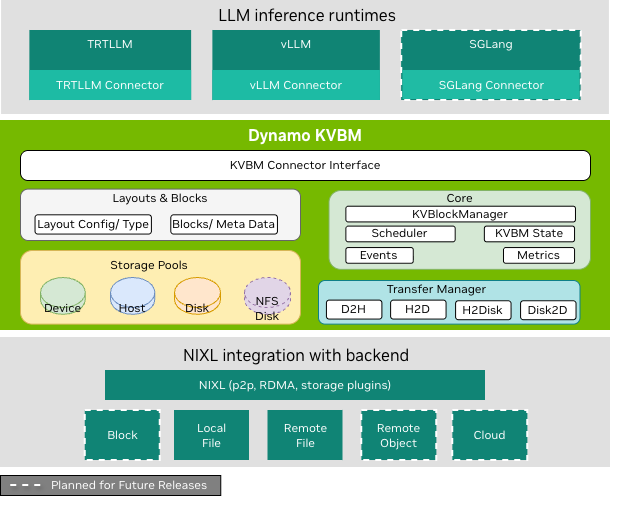

If you've ever tried to scale an LLM deployment past a single GPU node, you've hit the KV cache problem. Every token your model has already processed lives in GPU memory — the key-value tensors from its attention layers. In a standard aggregated serving setup, they stay local. In a disaggregated setup, where prefill and decode run on separate GPU pools, those tensors have to travel between machines fast enough to not stall the pipeline. How you move them determines whether disaggregated serving actually helps or just adds latency.

NVIDIA's answer to this is NIXL — the NVIDIA Inference Xfer Library. It's the transport layer underneath Dynamo's disaggregated serving, and it handles GPU-to-GPU KV cache transfer via RDMA, NVLink, and UCX. This post walks through what NIXL is, how Dynamo's `nixl_connect` wrapper uses it, and a subtle API compatibility issue I fixed this week that would have caused silent failures when NIXL removes its legacy memory type aliases.

## Why Disaggregated Serving Needs a Dedicated Transfer Layer

Standard LLM serving treats prefill and decode as one operation: prompt in, tokens out, all on the same GPU. This is straightforward but inefficient. Prefill — processing the prompt — is compute-bound: you're doing a large forward pass in parallel over all input tokens. Decode — generating each new token — is memory-bandwidth-bound: you're loading all the model weights for each output step. Running them on the same hardware means each is compromising the other's optimal resource usage.

Disaggregated serving splits them. Prefill runs on a pool of compute-optimized GPUs, decode runs on a memory-bandwidth-optimized pool, and requests route through both. The catch: after prefill finishes, the KV cache it built up — potentially gigabytes for a long prompt — needs to arrive at the decode worker before decode can start. This transfer is on the critical path of time-to-first-token.


*Figure 1: The communication stack for disaggregated serving in Dynamo — NIXL sits between the inference runtimes (vLLM, TRT-LLM, SGLang) and the transport hardware (NVLink, InfiniBand, UCX). — via [ai-dynamo/dynamo](https://github.com/ai-dynamo/dynamo)*

If you route that transfer through host memory — CPU-mediated copies — you pay two PCIe round trips per transfer. At H100 scale, each 40GB KV cache for a long-context request takes seconds to move. That's a latency disaster. The solution is direct GPU-to-GPU transfer: one GPU writes directly to another GPU's memory over NVLink or InfiniBand, with no CPU in the loop. That's what NIXL enables.

## What NIXL Actually Is

NIXL is a communication library purpose-built for AI inference workloads. It sits above UCX (Unified Communication X) and exposes a simpler interface for the specific patterns that show up in KV cache transfer: point-to-point RDMA writes from one GPU's KV buffer to another, with async completion tracking and buffer registration.

It supports three underlying transports:

- **NVLink** — for GPUs in the same server or NVSwitch fabric. Highest bandwidth, lowest latency.
- **InfiniBand via UCX** — for cross-node transfers. RDMA over IB bypasses the CPU entirely.
- **AWS EFA via libfabric** — for cloud deployments on p5/p4 instances. UCX with SRD transport, which Dynamo configures automatically.

NIXL abstracts which transport is in use. The calling code registers memory regions, creates transfer descriptors, and initiates operations — NIXL picks the right transport based on topology.

The key concept in NIXL's API is the **segment type** — a string identifier for what kind of memory you're addressing. The canonical segment types map to the underlying hardware:

| Segment Type | Memory |
|---|---|
| `"VRAM"` | GPU device memory (CUDA-addressable) |
| `"DRAM"` | Host (CPU) memory |
| `"FILE"` | Storage-backed memory |
| `"BLOCK"` | Block device memory |
| `"OBJ"` | Object storage |

For KV cache transfer, the relevant types are `"VRAM"` (GPU-to-GPU) and `"DRAM"` (GPU-to-CPU offload). These names come from the C++ layer and are the canonical identifiers in NIXL's internal APIs.

## Dynamo's nixl_connect Layer

Dynamo wraps NIXL in a Python module called `nixl_connect`. It's ~2,000 lines of asyncio-compatible code that translates between Dynamo's serving abstractions and NIXL's C-level APIs.

The central abstractions are `Descriptor`, `Connection`, and `Operation`:

- A **Descriptor** wraps a pointer to a memory buffer (GPU tensor, CPU array, or raw pointer) along with its size and device location.
- A **Connection** represents a registered channel between two Dynamo workers. It holds a NIXL agent with buffer registrations.
- An **Operation** is an async-awaitable RDMA transfer. You create one from source and destination descriptors, initiate it, and `await` completion.

Before you can transfer data, the memory must be **registered** with NIXL. Registration is what enables RDMA: the NIC or GPU DMA engine is told about a memory region ahead of time so it can access it without CPU intervention. In `nixl_connect`, this happens in `Descriptor._register()`.

The key bridge between Dynamo's world and NIXL's API is the `DeviceKind` enum:

```python
class DeviceKind(IntEnum):
    UNSPECIFIED = 0
    HOST = 1   # CPU/DRAM
    CUDA = 2   # GPU/VRAM

    def __str__(self) -> str:
        if self == DeviceKind.HOST:
            return "cpu"
        elif self == DeviceKind.CUDA:
            return "cuda"
```

`DeviceKind` tells Dynamo what kind of device a buffer lives on. `__str__` serializes it for metadata exchange — "cpu"/"cuda" appear in transfer metadata, logging, and serialization paths. But historically, those same strings were also being passed directly to NIXL's internal API as `mem_type`.

## The Memory Type Aliasing Problem

NIXL's Python API accepts a `mem_type` parameter in several places — when creating transfer descriptor lists and when registering memory for non-tensor buffers. Until recently, NIXL's Python layer accepted both the canonical names (`"VRAM"`, `"DRAM"`) and legacy string aliases (`"cuda"`, `"cpu"`) by mapping them via a lookup dict called `nixl_mems`.

The operative word is "until recently." The NIXL team has explicitly flagged these aliases for removal in [ai-dynamo/nixl#1534](https://github.com/ai-dynamo/nixl/issues/1534). The intent is to keep only the canonical C++ segment names going forward.

Dynamo's `nixl_connect` was passing the legacy strings at three places:

```python
# Site 1 — creating local transfer descriptor list
self._local_xfer_descs = self._connection._nixl.get_xfer_descs(
    descs=self._local_desc_tlist,
    mem_type=str(self._local_device_kind),  # "cuda" or "cpu"
)

# Site 2 — creating remote transfer descriptor list
self._remote_xfer_descs = self._connection._nixl.get_xfer_descs(
    descs=self._remote_desc_tlist,
    mem_type=str(self._remote_device_kind),  # "cuda" or "cpu"
)

# Site 3 — registering non-tensor memory
reg_list = [(ptr, size, device_id, mem_type)]
self._nixl_hndl = connection._nixl.register_memory(reg_list, mem_type)  # "cuda" or "cpu"
```

All three call `str(device_kind)`, which returns `"cuda"` for GPU buffers. When NIXL removes its `nixl_mems` alias dict, these calls will fail with a key lookup error. At that point, every RDMA transfer in a disaggregated Dynamo deployment — prefill-to-decode KV cache movement — would crash at operation initialization. Not gracefully, not with a clear error: the `get_xfer_descs` call would throw an exception mid-transfer.

The correct values to pass are `"VRAM"` (for GPU memory) and `"DRAM"` (for host memory). They're valid in all NIXL versions back to at least 0.10.x, making any fix backward-compatible.

## NIXL in the Broader Dynamo Architecture

NIXL isn't just used in the base KV transfer path. It's the transport substrate for Dynamo's KV Block Manager (KVBM) — the component that handles multi-tier KV cache storage and offloading.


*Figure 2: KVBM's three-layer architecture. NIXL forms the bottom layer, handling all data movement: GPU-to-GPU P2P transfers, RDMA over InfiniBand, NVLink sharing, and storage backend I/O. — via [ai-dynamo/dynamo](https://github.com/ai-dynamo/dynamo)*

KVBM exposes a unified memory API spanning GPU HBM, pinned host DRAM, remote RDMA-accessible memory, and disk. Under the hood, every cross-device transfer in KVBM goes through NIXL. The memory type identifiers matter here too — KVBM registers GPU blocks as VRAM segments, host offload buffers as DRAM segments, and file-backed storage as FILE segments. Getting the segment type wrong doesn't just fail one transfer; it breaks the entire memory registration, meaning KVBM can't hand off blocks between tiers.

This is why the canonical naming matters beyond the immediate fix. The `nixl_mem_type` property introduced in the fix is the right abstraction boundary: `DeviceKind` knows what hardware a buffer lives on, and `nixl_mem_type` translates that into NIXL's API vocabulary. As NIXL adds new segment types in future (BLOCK, OBJ), they can be added to this property without touching the call sites.

## API Compatibility and Deprecation in C++ Bindings

This class of bug — code that depends on alias layers in a C++ library's Python bindings — is common and easy to miss. The Python layer accepts both names, tests pass, everything works. Then the C++ library removes the compatibility shim in a minor version bump and callers start throwing `KeyError` in production.

NIXL's `nixl_mems` dict is precisely this kind of shim. It exists to ease migration, not to be permanent API. When the aliases go away, any code using them against a newer NIXL version will fail at runtime, not import time — and it'll fail inside an async operation that was working fine yesterday.

The safe pattern when wrapping a C++ library through Python bindings: always use the canonical identifiers the C++ layer knows about, and keep a clear abstraction boundary between your domain terms and the external API vocabulary. `DeviceKind.HOST` is Dynamo's concept; `"DRAM"` is NIXL's concept. They should meet at exactly one place.

## My Contributions

**PR [#9597](https://github.com/ai-dynamo/dynamo/pull/9597) — fix: use canonical NIXL segment names for mem_type in nixl_connect**

This PR addresses [issue #9071](https://github.com/ai-dynamo/dynamo/issues/9071), a contribution request from the Dynamo team to future-proof `nixl_connect` against NIXL's planned removal of legacy alias strings.

The change adds a `nixl_mem_type` property to `DeviceKind` that returns the canonical C++ segment name — `"VRAM"` for `DeviceKind.CUDA` and `"DRAM"` for `DeviceKind.HOST`:

```python
@property
def nixl_mem_type(self) -> str:
    if self == DeviceKind.HOST:
        return "DRAM"
    elif self == DeviceKind.CUDA:
        return "VRAM"
    else:
        raise ValueError(f"No canonical NIXL mem_type for DeviceKind: {self}")
```

The three `mem_type=str(device_kind)` call sites in `__init__.py` are updated to `mem_type=device_kind.nixl_mem_type`. `DeviceKind.__str__()` is left unchanged — it's used for metadata exchange and serialization where the `"cpu"`/`"cuda"` strings are the right representation.

A unit test file (`test_nixl_connect_device_kind.py`) verifies the property returns correct values for HOST and CUDA, confirms `__str__` is unchanged, and checks that unsupported DeviceKind values raise an appropriate error. The tests require NIXL native bindings to execute (CPU-only CI doesn't have them), but they pass locally with a full NIXL install.

The PR has passed ruff linting and mypy type checks. The fix is backward-compatible with NIXL versions back to 0.10.x, making it safe to land ahead of any NIXL upgrade.
