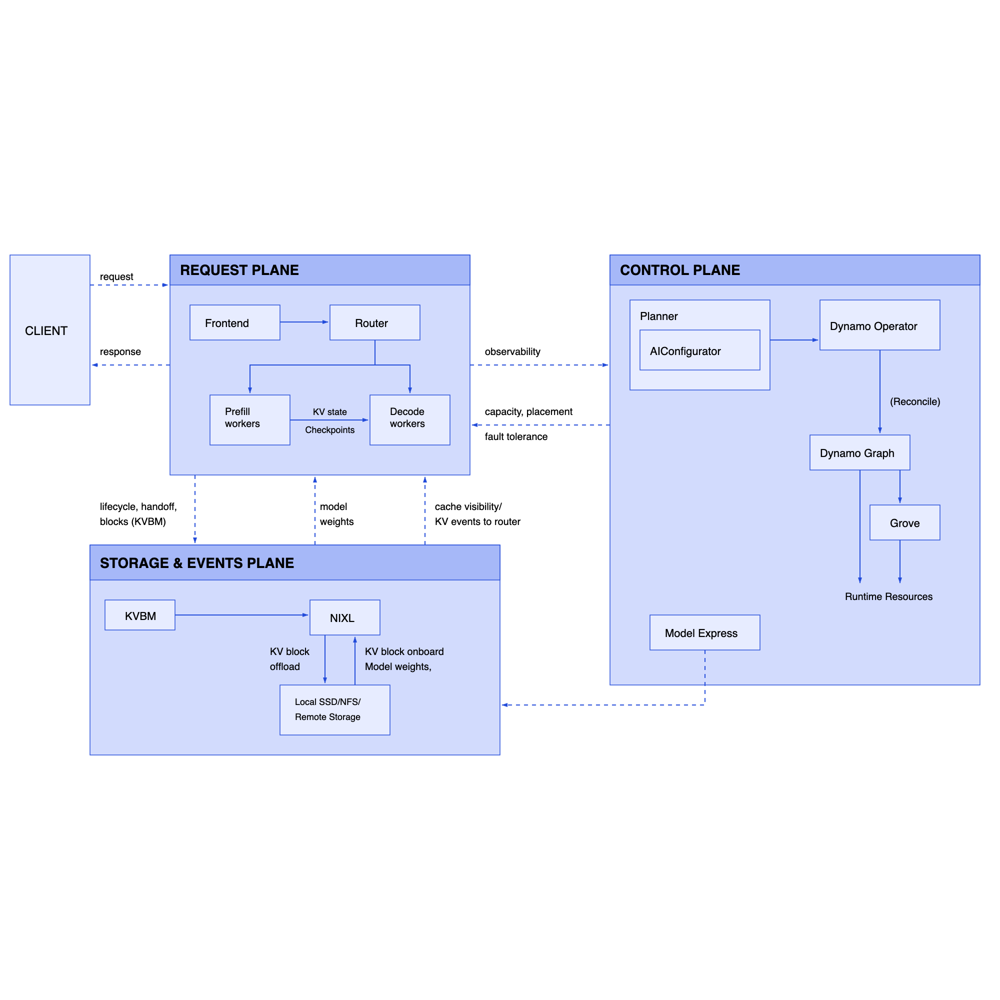

If you've tuned your TRT-LLM KV-cache buffer sizes for a production deployment — carefully selecting `event_buffer_max_size`, `free_gpu_memory_fraction`, or custom cache transceiver settings — there's a reasonable chance those values aren't actually reaching the engine. They can disappear somewhere in Dynamo's initialization pipeline, replaced silently by defaults. No warning. No error. Just wrong behavior at runtime, discoverable only when you notice missing observability metrics or degraded cache utilization.

The same quiet failure mode exists at a lower level of the stack: in `nixl_connect`, the binding that handles KV-cache transfers between GPU pools in disaggregated serving. For the last several NIXL versions, Dynamo has been passing legacy memory type aliases (`"cuda"`, `"cpu"`) to the NIXL transfer API. NIXL still accepts them — but only as backward-compatibility shims scheduled for removal. When that happens, KV-cache transfers between prefill and decode workers will start failing silently at initialization.

This post explains both failure modes, why they're hard to detect, and how the fixes work.

## Dynamo's Disaggregated Inference Stack

To understand where these failures live, you need a mental model of how Dynamo assembles a production inference deployment.

Dynamo is NVIDIA's distributed inference serving framework, designed for high-throughput LLM serving at scale. Its defining architectural feature is **disaggregated prefill/decode serving**: rather than running both phases of inference on the same set of GPUs, Dynamo separates them into independent worker pools.


*Figure 1: NVIDIA Dynamo's inference architecture — [ai-dynamo/dynamo](https://github.com/ai-dynamo/dynamo)*

This separation matters because the two phases have fundamentally different compute profiles. Prefill is compute-bound: it processes the entire input context in one forward pass, making large GEMMs across all attention heads. Decode is memory-bandwidth-bound: it generates one token at a time, making tiny GEMMs but needing the entire KV cache resident in GPU memory. Running them on the same hardware forces a compromise — prefill wants high tensor parallelism, decode wants large KV-cache headroom.

In a disaggregated deployment, a request follows this path:

1. The **PrefillRouter** receives the request and selects a prefill worker
2. The **prefill worker** computes attention over the input context, generating the KV cache for all layers
3. The KV cache is **transferred to the decode worker** via NIXL — directly GPU-to-GPU, without touching host memory
4. The **decode worker** generates tokens using the transferred KV state

Each worker runs a backend engine — typically TensorRT-LLM, vLLM, or SGLang. The TRT-LLM backend is Dynamo's most feature-complete integration, supporting aggregated and disaggregated serving, KV-cache events, custom connectors, and a rich configuration surface. That configuration surface is also where the first silent failure lives.

## NIXL: The KV-Cache Transfer Fabric

NIXL (NVIDIA's cross-library transfer API) is the transport layer that makes disaggregated serving practical. Without it, transferring KV cache between GPU pools would require staging through host memory — a round-trip that adds tens of milliseconds to time-to-first-token on large models with long contexts.

NIXL operates on **memory segments**, identified by their canonical type name:
- **VRAM** — GPU device memory
- **DRAM** — host CPU memory
- **FILE**, **BLOCK**, **OBJ** — storage backends for KV cache offloading

These are the C++-level segment names. NIXL historically also accepted `"cuda"` and `"cpu"` as lowercase aliases. The problem: Dynamo's `nixl_connect` Python module has been passing the aliases, not the canonical names.

`nixl_connect` wraps the NIXL C extension and provides the Python-facing API for KV transfer. Its `DeviceKind` enum represents the relevant device types, and `__str__` returns the legacy strings:

```python
class DeviceKind(IntEnum):
    HOST = ...   # CPU memory
    CUDA = ...   # GPU VRAM

    def __str__(self) -> str:
        if self == DeviceKind.HOST:
            return "cpu"
        elif self == DeviceKind.CUDA:
            return "cuda"
```

At three call sites — two in `get_xfer_descs()` and one in `register_memory()` — the code called `str(device_kind)` and passed that string directly to NIXL as `mem_type`. This works today because NIXL still maintains the aliases. But the NIXL team has documented the plan to remove them ([nixl#1534](https://github.com/ai-dynamo/nixl/issues/1534)), keeping only the canonical segment names. When that cleanup ships, every disaggregated deployment using this code path will fail at KV transfer initialization — not with a helpful diagnostic, but with an opaque exception about an unknown segment name.

The fix adds a dedicated property to `DeviceKind`:

```python
@property
def nixl_mem_type(self) -> str:
    if self == DeviceKind.HOST:
        return "DRAM"
    elif self == DeviceKind.CUDA:
        return "VRAM"
    else:
        raise ValueError(f"No canonical NIXL mem_type for {self}")
```

The key design choice: `__str__()` is intentionally left unchanged. Other parts of the codebase use `str(DeviceKind)` for serialization and metadata exchange between workers — changing `__str__` would break those paths. The `nixl_mem_type` property is scoped specifically to the NIXL API boundary. Three `str(device_kind)` calls become `device_kind.nixl_mem_type`, and the code is now forward-compatible with NIXL's planned cleanup.

## TRT-LLM's Configuration Pipeline: A Recurring Leak

The TRT-LLM backend in Dynamo supports a layered configuration surface. Users can supply engine arguments via a YAML config file, via `--extra-engine-args` (additional args merged in), and via `--override-engine-args` (a JSON blob that takes explicit precedence). All of these funnel into a dict called `arg_map` in `init_llm_worker()`, which is eventually unpacked as `LLM(**arg_map)`.

{{< figure src="trtllm-arg-map-pipeline.svg" alt="TRT-LLM arg_map mutation pipeline showing how user configuration values can be silently overwritten" caption="The TRT-LLM configuration mutation pipeline. User values from YAML, extra-engine-args, and override-engine-args flow into arg_map, but pass through several internal mutation stages where values can be silently overwritten: merge extra args, KvCacheConfig dict-to-object conversion (3 historical bugs here), publish_events_and_metrics block (return_perf_metrics dropped in PR #9284), and override-engine-args deep merge. The fix (PR #9632) snapshots user keys before mutations and diffs against the final arg_map, logging warnings for any overwrites." >}}

Between user input and `LLM(**arg_map)`, the dict gets mutated in sequence: extra args merged, `_sync_config_from_engine_args()` called, a `publish_events_and_metrics` block that sets `return_perf_metrics` and mutates `kv_cache_config`, a `KvCacheConfig` dict-to-object conversion, and finally the `override_engine_args` deep-update. Each step can overwrite values from earlier steps.

This has happened three times in recent releases:

- **September 2025**: A `dict→KvCacheConfig` refactor dropped the `if not event_buffer_max_size` guard, causing user-supplied buffer sizes to be silently replaced with the 1024 default.
- **January 2026** (PR #5198): Partially fixed — preserved most `KvCacheConfig` settings via `model_dump`, but left the `event_buffer_max_size` conditional unrestored.
- **March 2026** (PR #9284): Fixed `event_buffer_max_size` properly, but in the same change dropped `arg_map["return_perf_metrics"] = config.publish_events_and_metrics`. After that PR, vanilla `--publish-events-and-metrics` deployments silently lost TRT-LLM's `PerfMetricsManager` — GPU forward/sample timing, step metrics, OTEL spans — unless they were explicitly injecting `return_perf_metrics: true` in their OTEL launch scripts.

Three separate regressions in the same six-line block, none caught by existing tests, none producing any startup error. The failure mode in each case: correct-looking responses, silent loss of observability instrumentation or user-tuned cache parameters.

Adding per-field conditional guards (the pattern used in #5198 and #9284) fixes one regression while setting up the next. The problem is structural: any future change to `init_llm_worker` that touches `kv_cache_config` can introduce the same bug class.

The fix adds an audit mechanism. Before mutations begin, the code snapshots whichever `kv_cache_config` keys the user supplied via `override_engine_args`. After all mutations complete, it compares those keys against the final `arg_map`:

```python
if _user_kv_overrides:
    _final_kv = arg_map.get("kv_cache_config", {})
    for _k, _user_val in _user_kv_overrides.items():
        if _k not in _final_kv:
            logging.warning(
                "User-supplied kv_cache_config.%s was dropped by Dynamo internals", _k
            )
        elif _final_kv[_k] != _user_val:
            logging.warning(
                "User-supplied kv_cache_config.%s was overwritten: %r -> %r",
                _k, _user_val, _final_kv[_k],
            )
```

This doesn't prevent a future clobber — that would require a deeper refactor of the mutation pipeline. What it does is make any future clobber **visible**: a warning in the worker startup log that surfaces in monitoring before the regression ships to production. The PR also adds regression tests that feed non-default values for the historically-fragile fields through the full worker init path and assert they survive into the final `arg_map` unchanged.

## The Cost of Silent Misconfiguration

Both bugs share the same failure signature: the system continues running, returns results, and logs nothing anomalous at startup. The NIXL alias bug produces working transfers until the day NIXL removes the shims. The TRT-LLM config leak produces correct-looking responses without the observability instrumentation you thought you'd enabled — or with KV-cache tuning that silently reverted to defaults.

Silent misconfiguration is more expensive to debug than a crash. A crash gives you a stack trace and a timestamp. A silent failure gives you "metrics look off" and weeks of behavioral regression to trace backward through framework changelog entries. At H100 inference scales — $3–4/hour per GPU, 8–64 GPU deployments — the engineering time to track a subtle regression back to a dropped configuration key easily exceeds the cost of an outright failure.

For anyone operating Dynamo deployments: if you supply custom `kv_cache_config` values, verify them against worker startup logs after upgrades. With the new audit mechanism in place, silent overwrites will surface as `WARNING` lines at startup. If you're on an older version without the audit, a manual diff of your YAML config against TRT-LLM's documented defaults is the only way to confirm your values are actually reaching the engine.

The deeper pattern: both of these bugs are **interface contract violations** — places where one layer of the stack passes data to another layer without respecting what that layer actually accepts. NIXL has a documented API contract (canonical segment names); `nixl_connect` was violating it. TRT-LLM's `LLM()` constructor accepts an `arg_map` representing user intent; Dynamo's initialization pipeline was modifying that map without surfacing the changes. Making those contracts explicit and observable is what prevents the next instance of the bug class.

## My Contributions

**[PR #9597 — fix: use canonical NIXL segment names for mem_type in nixl_connect](https://github.com/ai-dynamo/dynamo/pull/9597)**

Adds the `nixl_mem_type` property to `DeviceKind` in `lib/bindings/python/src/dynamo/nixl_connect/__init__.py` and replaces all three legacy `str(device_kind)` calls with `.nixl_mem_type`. The change is backward-compatible with all NIXL versions back to at least 0.10.x — both `"DRAM"` and `"VRAM"` are valid segment names in those versions — and forward-compatible with the planned alias removal tracked in [nixl#1534](https://github.com/ai-dynamo/nixl/issues/1534). The `__str__` method is left unchanged to avoid breaking serialization in other parts of the codebase. Unit tests added for the new property and for the call sites that use it.

**[PR #9632 — fix: enforce user-config preservation in TRT-LLM worker arg_map](https://github.com/ai-dynamo/dynamo/pull/9632)**

Adds a pre/post audit mechanism to `init_llm_worker()` in `components/src/dynamo/trtllm/workers/llm_worker.py`. The fix snapshots `kv_cache_config` keys from `override_engine_args` before the internal mutation chain runs, then compares them against the final `arg_map` and emits `logging.warning` for any keys that were dropped or overwritten. Also refactors the existing `_warn_override_collisions` local function into the shared `trtllm_utils.warn_override_collisions` for broader reuse, and adds regression tests for historically-fragile fields that verify end-to-end preservation through the full worker initialization path.
