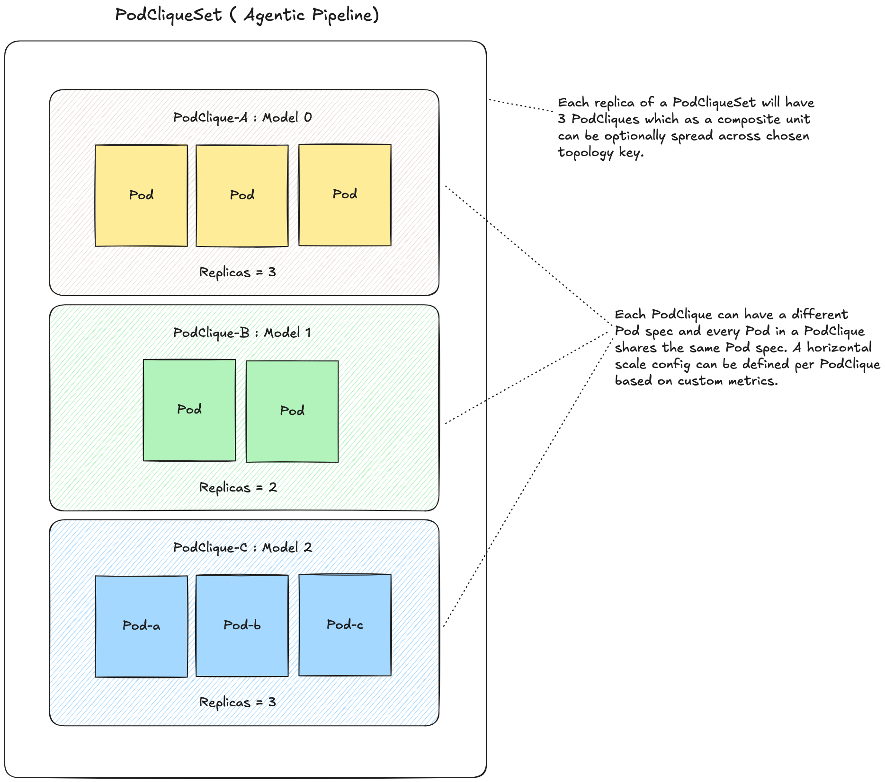

If you've ever tried to debug a failing inference replica across a 50-pod deployment, you know the problem immediately. Your monitoring system reports that hostname `ubuntu-0-worker-0` crashed — but when you run `kubectl get pods`, you see `ubuntu-0-worker-2tnab` and `ubuntu-0-worker-5mfde`. There's no direct mapping. You end up writing a custom kubectl column query, or digging through labels, or guessing. Meanwhile the outage clock is ticking.

This isn't a Kubernetes quirk specific to inference. But inference makes it dramatically worse, because the pods you're debugging aren't independent replicas of a stateless API server. They're coordinated pieces of a single logical model instance — and debugging one requires understanding its relationship to a dozen others.

Grove is the Kubernetes operator that NVIDIA built to manage this complexity. It provides a single declarative API for orchestrating any AI inference workload, from a single-GPU deployment to a multi-thousand-GPU disaggregated system.

## Why Kubernetes Alone Isn't Enough

Standard Kubernetes was designed for stateless, independent workloads: each pod can start, stop, and reschedule without coordination. Modern AI inference violates almost every assumption that design makes.

Consider a disaggregated inference deployment for a large model like DeepSeek-R1 or Llama-4-Maverick. The architecture splits inference into two stages: **prefill** (processing the prompt and generating the KV-cache) and **decode** (generating output tokens), each running on a separate GPU pool with KV-cache transferred over high-speed interconnects.

*Figure 1: Multi-node disaggregated inference — prefill and decode pools as separate Kubernetes pod groups. — [Grove docs](https://github.com/ai-dynamo/grove)*

Each pool node may itself span multiple machines: a model-parallel leader pod plus several worker pods that together hold one shard of the model. None of these pods are useful in isolation. If decode workers start before the leader, the application deadlocks. Standard Kubernetes primitives — Deployments, StatefulSets, ReplicaSets — schedule pods independently, don't enforce startup ordering between groups, and have no concept of gang scheduling or hierarchical coordination.

Grove addresses all of this with four primitives.

## The Grove Resource Hierarchy

**PodClique** is the foundation. It represents a group of pods sharing the same configuration and forming a single functional role: all the worker pods in a tensor-parallel group, all the decode nodes in a disaggregated pipeline. A PodClique behaves like a ReplicaSet but adds gang termination — when the clique is removed, all its pods terminate together.

**PodCliqueScalingGroup** (PCSG) coordinates multiple PodCliques that must scale together in a fixed ratio. The classic example is a leader-worker multi-node instance: always one leader per four workers, scheduled as an all-or-nothing unit. If there's no room for a complete group, none of them land.

**PodCliqueSet** (PCS) is the top-level object: the complete inference service. A PCS replica represents one fully functional copy of your serving system — prefill pool, decode pool, router — specified in a single manifest. Scaling the PCS adds another complete inference stack, useful for canary deployments, A/B tests, or availability zone spread.

**PodGang** is the scheduler-side API. Grove's scheduler plugin reads PodGangs and enforces topology constraints — ensuring, for example, that workers in a multi-node instance land within a single NVLink domain for low-latency GPU-to-GPU communication.

Grove can express a wide range of inference architectures with these four primitives: disaggregated multi-node deployments, agentic pipelines of multiple model tiers, standard aggregated serving, and MoE deployments with expert parallelism.

*Figure 2: An agentic pipeline expressed as a Grove PodCliqueSet — multiple model roles coordinated as a single deployable unit. — [Grove docs](https://github.com/ai-dynamo/grove)*

## The Kubernetes Controller Model

Grove implements the standard operator pattern: three reconciliation controllers (one each for PodCliqueSet, PodClique, and PodCliqueScalingGroup) watch for changes to their custom resources and reconcile observed cluster state toward desired state. When you scale a PCS from 2 to 3 replicas, the PCS controller creates the new PodCliques, the PodClique controller creates the pods, and the scheduler plugin places them correctly.

This pattern is elegant at small scales. At large scales — say, a 5,000-replica deployment with 50+ pods per replica — it accumulates operational friction that isn't obvious until you're in production.

## Three Operational Realities at Scale

### Pod Names Don't Map to Pod Identity

Grove generates pod names by appending a random suffix to the PodClique name: `ubuntu-0-worker-2tnab`, `ubuntu-0-worker-5mfde`. The random suffix guarantees uniqueness; the PodClique name identifies the role. What's missing is the **pod index** — which instance within the clique is this pod?

The index matters because distributed applications track it. When a job fails and logs report a crash at node index 3, you need to find the pod at index 3. Grove already stored this as a label (`grove.io/podclique-pod-index`) and exposed it as an environment variable — but it wasn't in the pod name, so correlating a crash-log hostname to a running pod required a custom `kubectl` column query.

Embedding the pod index directly in the generated name prefix — `ubuntu-0-worker-0-2tnab`, `ubuntu-0-worker-1-5mfde` — lets `kubectl get pods` output directly show each pod's logical position. At scale, when a 5,000-node job fails, operators need to land on the right pod in seconds.

### Log Noise Obscures Real Failures

When a PodCliqueSet is deleted, Kubernetes cascades downward: PCS first, then its owned PodCliques, then pods via garbage collection. During this sequence, the PodClique controller keeps receiving reconcile events for already-deleted PodCliques, each triggering an `info`-level log: `PodClique not found`. At scale — deleting a 5,000-replica deployment — this generates thousands of identical log lines.

The problem isn't cosmetic. When real failures happen — a PodClique disappearing while its parent PCS is still live — they generate the same message. Operators conditioned to ignore it during routine deletions will also ignore it when it signals a genuine problem.

The correct model distinguishes these cases. Routine NotFound events during cascade-delete should be at debug verbosity (`V(1)`), disappearing from default logs while remaining accessible with `-v=1`. An unexpected NotFound while the parent PCS is live and not deleting warrants a contextual `info` log naming the missing PodClique and affected replica. That's the signal requiring operator attention.

### No Visibility Into Controller Performance

Until recently, Grove exposed zero custom Prometheus metrics. During large-scale deployments — 5 services × 10 replicas generating 50+ pods simultaneously — the controller reconciliation loop can become a bottleneck. Status changes cascade upward through the hierarchy: pod status changes trigger PodClique reconciliation, which triggers PCS reconciliation. Under high churn, 409 Conflict errors occur when the Dynamo orchestrator and Grove controllers attempt concurrent updates to the same object.

Without metrics, there was no way to answer basic questions: How long does reconciliation take under load? Is the controller falling behind? Which sub-operation is the bottleneck? What's the conflict rate?

Adding Prometheus instrumentation to all three controllers surfaces five metrics in the `grove_operator_*` namespace:

- `grove_operator_reconcile_total` — total reconcile calls, labeled by controller and result
- `grove_operator_reconcile_duration_seconds` — reconcile latency histogram
- `grove_operator_in_flight_reconciles` — current reconcile concurrency per controller
- `grove_operator_operation_duration_seconds` — per-sub-operation timing for `reconcile_spec` and `reconcile_status`
- `grove_operator_conflict_total` — 409 Conflict rate by controller

These metrics are purely additive — no reconcile logic changes — and surface on the existing controller-runtime `/metrics` endpoint. For teams running Dynamo-based inference graphs, Grafana dashboards and Prometheus alerts for controller health become possible without additional infrastructure.

## The Cost of Operational Friction

The economic argument for operational tooling in distributed inference is direct. An H100 GPU runs $3–5/hour on major cloud providers. A disaggregated deployment for a production-scale model uses 32–128 GPUs. At that scale, a 15-minute debugging session triggered by unclear pod names or log noise costs $25–100 in GPU time alone — before counting engineer time or user-facing latency during the incident.

More importantly: the inability to observe your infrastructure pushes you toward conservative operations. Teams that can't measure controller performance don't know whether their deployment is near capacity or has headroom. That uncertainty leads to over-provisioning, which is the most expensive failure mode in inference infrastructure. When you're spending millions annually on inference compute, over-provisioning by 20% is a larger line item than the engineering cost of fixing the tooling.

Grove's operational improvements — naming, log hygiene, metrics — aren't features for their own sake. They're the instrumentation that makes it viable to run the system closer to its actual limits.

## My Contributions

My recent work on Grove focused on three areas where the gap between design goals and operational reality was most visible at scale.

**PR #656 — Pod index in pod names** ([ai-dynamo/grove#656](https://github.com/ai-dynamo/grove/pull/656)): Modified `buildResource` in `pod.go` to embed the pod-clique pod index in the `GenerateName` prefix, producing names like `ubuntu-0-worker-0-2tnab` instead of `ubuntu-0-worker-2tnab`. Updated `extractPCLQNameFromPodName` in `register.go` to strip two trailing segments so the existing PodGang→PodClique mapping resolves correctly. Added unit tests covering multiple clique names and indices. Closes [#635](https://github.com/ai-dynamo/grove/issues/635).

**PR #641 — Cascade-delete log noise** ([ai-dynamo/grove#641](https://github.com/ai-dynamo/grove/pull/641)): Changed the `GetPodClique` not-found branch in `reconciler.go` from `logger.Info` to `logger.V(1).Info`, eliminating thousands of routine log entries during normal PCS deletion. Added a contextual `Info`-level log in the gang-termination path when a PodClique expected by a live PCS is unexpectedly missing. Added unit tests for both the debug-level and error-propagation paths. Closes [#622](https://github.com/ai-dynamo/grove/issues/622).

**PR #633 — Prometheus reconciliation metrics** ([ai-dynamo/grove#633](https://github.com/ai-dynamo/grove/pull/633)): Added a new `internal/metrics` package with an `ObservedReconciler` wrapper and `StartOperation`/`done()` sub-operation timing. Wired all three controllers through the wrapper via their `RegisterWithManager` `Complete()` calls, with zero changes to reconcile logic. Five new metrics cover reconcile count, latency, in-flight gauge, sub-operation latency, and conflict rate. Closes [#498](https://github.com/ai-dynamo/grove/issues/498).
