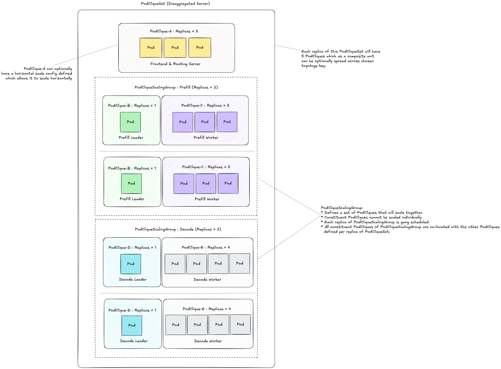
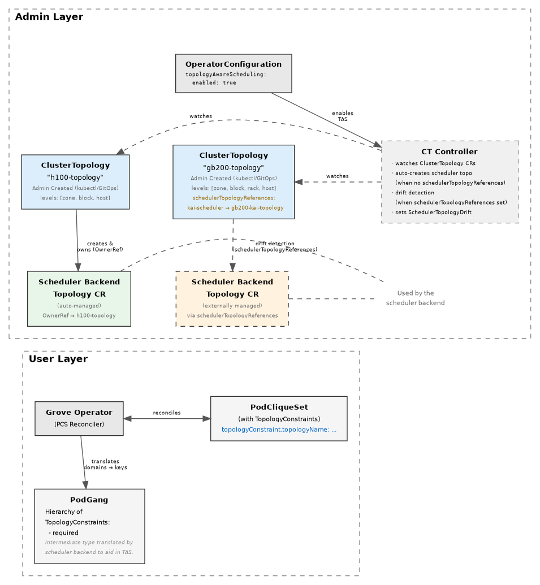

If you've ever operated distributed inference on Kubernetes, this scenario is familiar: a routine control plane event — an API server rolling upgrade, a brief etcd hiccup during leader election churn — takes down your inference operator. Not gracefully degrades. Crashes it. Because a transient 503 at startup is treated identically to a permanent configuration error, and there's no retry logic to distinguish the two.

In a deployment running one model replica on one GPU, you restart the operator and move on. In a deployment with a disaggregated inference stack spanning 64 GPUs, with three operator replicas for high availability, and active user traffic, this is an incident. And it's the exact gap that last week's contribution to [Grove](https://github.com/ai-dynamo/grove) addresses.

## What Is Grove?

Grove is NVIDIA's open-source Kubernetes operator for AI inference orchestration. It provides a declarative API for describing inference serving systems — from a single-GPU deployment to a multi-thousand-GPU disaggregated pipeline — and handles the coordination problems that stock Kubernetes wasn't designed for: hierarchical gang scheduling, topology-aware GPU placement, startup ordering, and multi-level autoscaling.

{{< figure src="grove-podcliqueset.svg" alt="Grove PodCliqueSet containing Prefill, Decode, and Router PodCliques with optional PodCliqueScalingGroup" caption="Grove PodCliqueSet architecture: the complete inference stack is described as a single resource containing multiple PodCliques (Prefill, Decode, Router). Each PodClique defines pods with specific roles and topology constraints (e.g., NVLink island placement). An optional PodCliqueScalingGroup provides gang scheduling — all PodCliques scheduled together or none, ensuring complete inference stacks land atomically on the cluster with no partial deployments." >}}

The core abstraction is the **PodCliqueSet** (PCS), which describes your complete inference stack as a single Kubernetes resource. Inside a PCS, you define **PodCliques** for each role — one for prefill workers, one for decode workers, one for a router — and optionally group them into **PodCliqueScalingGroups** that schedule as all-or-nothing gangs. From that one spec, Grove handles placement, ordering, and scaling.


*Figure 1: Multi-node disaggregated inference with Grove — prefill and decode pools as PodCliques within a single PodCliqueSet. KV-cache transfers over high-speed interconnects are managed separately; Grove's job is ensuring the pods land correctly and start in the right order — [ai-dynamo/grove](https://github.com/ai-dynamo/grove)*

This matters because standard Kubernetes scheduling has no concept of "schedule these eight pods on NVLink-connected nodes, or don't schedule any of them." It doesn't understand that your tensor-parallel decode group needs all eight GPUs on the same NVSwitch fabric to meet latency targets, or that MPI workers must be ready before the leader initializes. Grove adds all of this on top of native Kubernetes primitives without replacing them.

## Topology-Aware Scheduling: How Grove Places GPU Pods

Grove's most important feature for large-scale inference is topology-aware scheduling — the ability to guarantee that pods land within a specific GPU interconnect domain (NVLink island, InfiniBand switch, rack, availability zone).


*Figure 2: Grove's topology-aware scheduling — `ClusterTopologyBinding` CRDs describe hardware hierarchy; the operator synchronizes these with downstream scheduler backends (KAI, Volcano) that enforce topology constraints at placement time — [ai-dynamo/grove](https://github.com/ai-dynamo/grove)*

The design separates cluster description from workload constraints:

**Admin layer**: Cluster administrators create `ClusterTopologyBinding` resources defining the hardware topology — which Kubernetes node labels correspond to which interconnect boundaries (rack, NVLink island, NVSwitch fabric, availability zone). A cluster with mixed hardware can have multiple bindings, one per hardware segment.

**Workload layer**: When a user creates a PodCliqueSet with topology constraints ("all decode workers within the same NVLink domain, packed as tightly as possible"), they reference a specific `ClusterTopologyBinding`. Grove translates that into scheduler-specific constraints for downstream backends — KAI Scheduler's `Topology` CRs, Volcano equivalents — that actually enforce placement.

The critical detail in this architecture: **at operator startup, Grove must synchronize backend topology resources before any controllers can reconcile**. The `SynchronizeTopology` call runs before `mgr.Start()` — before leader election — and lists all `ClusterTopologyBinding` resources, then creates or verifies the corresponding backend topology CRs. This ordering is intentional: you don't want a PodCliqueSet reconcile to reference a topology object that doesn't exist yet. The race condition is worse than the startup delay.

But that design has a fragility that only becomes visible under production conditions.

## The Startup Thundering Herd

In an HA Grove deployment, the operator runs with 2–3 replicas. `controller-runtime` leader election — which ensures only one active reconciler — activates inside `mgr.Start()`. But `SynchronizeTopology` runs *before* `mgr.Start()`, which means every replica, not just the future leader, independently runs the full synchronization against the Kubernetes API server at startup.

{{< figure src="grove-topology-sync.svg" alt="Grove topology synchronization problem: before and after the bounded backoff fix" caption="Grove startup topology synchronization. **Before fix (left):** All 3 HA replicas call SynchronizeTopology() before mgr.Start() / leader election, hammering the API server with C × B × k uncached calls each. Transient errors (503, timeout, connection refused) crash all replicas via handleErrorAndExit(). Kubelet restarts them immediately with no backoff — thundering herd. **After fix (right, PR #669):** SynchronizeTopologyWithRetry() with bounded exponential backoff (1s + 2s + 4s + 8s + 16s + 32s ≈ 63s total). Transient errors (503, timeout, io.EOF, ECONNREFUSED, rate-limit) are retried. Permanent errors (Forbidden, Unauthorized, missing CRD) fail fast. 10% jitter spreads retry load across replicas." >}}

In a cluster with `C` ClusterTopologyBindings and `B` topology-aware scheduler backends, that's `C × B × k` synchronous, uncached API calls per replica, where `k` is the number of API operations per binding. All of them go directly to the API server with no informer cache, because the informer cache lives inside the manager that hasn't started yet. With three replicas, multiply by three.

Before this week's fix, any error from any of those calls propagated immediately to `main.go`, which called `handleErrorAndExit`. The operator process exited. Systemd restarted it. With no application-level backoff — just kubelet exponential backoff — all three replicas immediately tried again while the API server was still recovering. This is textbook thundering herd: an overloaded API server gets hammered harder exactly when it needs load relief most.

The failure modes that trigger this aren't edge cases:
- API server rolling restart (routine upgrade)
- Etcd hiccup during leader election churn
- KAI webhook pod crashlooping (a `Create` for a KAI topology CR goes through KAI's validating webhook; if that webhook is down, the Create fails)
- Network blip between the operator pod and the API server

None of these should be fatal. All of them were.

## The Fix: Bounded Backoff with Error Classification

The solution wraps `SynchronizeTopology` in a bounded exponential backoff:

```go
var DefaultSyncRetryBackoff = wait.Backoff{
    Duration: time.Second,
    Factor:   2.0,
    Jitter:   0.1,
    Steps:    6,  // total budget: 1+2+4+8+16+32 ≈ 63 seconds
}

func SynchronizeTopologyWithRetry(
    ctx context.Context,
    cl client.Client,
    logger logr.Logger,
    backends map[string]scheduler.TopologyAwareBackend,
    backoff wait.Backoff,
) error {
    attempt := 0
    return retry.OnError(backoff, isTransientAPIError, func() error {
        if attempt > 0 {
            logger.Info("Retrying topology synchronization", "attempt", attempt+1)
        }
        attempt++
        return SynchronizeTopology(ctx, cl, logger, backends)
    })
}
```

The key design decision is error classification. Not every error should be retried:

```go
func isTransientAPIError(err error) bool {
    return apierrors.IsServerTimeout(err) ||
        apierrors.IsServiceUnavailable(err) ||
        apierrors.IsInternalError(err) ||
        apierrors.IsTimeout(err) ||
        apierrors.IsTooManyRequests(err)
}
```

This function handles Kubernetes `StatusError` types. A separate transport-level check covers errors that arrive before the API server even wraps them in a `StatusError` — `net.Error` timeouts, `io.EOF` (connection dropped mid-request), and `syscall.ECONNREFUSED` (API server not yet accepting connections during a rolling restart). These are retried. `Forbidden`, `Unauthorized`, and missing CRDs are returned immediately — those indicate misconfiguration, and retrying won't fix them.

The 10% jitter on each step spreads retry timing across the three HA replicas, reducing synchronized load spikes on a recovering control plane. A recovering API server facing three replicas with jittered backoff can process requests steadily; the same three replicas with synchronized retries can push it back into overload.

The total retry budget of roughly 63 seconds covers the common case of a rolling restart (typically 30–90 seconds end-to-end) without leaving the operator in a stuck state for more than a minute if the API server is genuinely unavailable.

## Why This Is Harder Than It Looks

The subtlety in this fix is that "transient" versus "permanent" error classification requires knowing the Kubernetes API server's error semantics — and those semantics extend into the network layer below the HTTP client.

A `Forbidden` error from the API server means Grove doesn't have RBAC permissions. Retrying won't help; the cluster admin needs to fix the `ClusterRole`. A `ServiceUnavailable` from the same endpoint means the API server's load balancer isn't ready yet — retry in a second and it will be fine.

But what about `io.EOF`? That's a Go `net` error, not a Kubernetes `StatusError`. The API server dropped the connection mid-request. `apierrors.IsServiceUnavailable` returns false for it, even though the right response is identical: wait, then retry. Getting the error classification right required testing against each failure mode from issue [#654](https://github.com/ai-dynamo/grove/issues/654), not just the obvious HTTP status codes.

## The Bigger Picture: Operating GPU Infrastructure at Scale

The startup hardening sits alongside two other operational improvements landed in recent weeks:

**Pod clique index in pod names** ([PR #656](https://github.com/ai-dynamo/grove/pull/656)): Grove pods were named `ubuntu-0-worker-2tnab` without the clique index. During incidents, correlating a crash-log hostname to a running pod required a custom `kubectl` column query. With the index embedded — `ubuntu-0-worker-0-2tnab` — the logical position is visible in standard output. Small change, large difference when debugging a 500-pod deployment under pressure.

**Cascade-delete log noise** ([PR #641](https://github.com/ai-dynamo/grove/pull/641)): During normal PodCliqueSet deletion, Grove's controllers receive reconcile events for already-deleted PodCliques and previously logged each at `info` level. Deleting a 5,000-replica test generated thousands of identical "PodClique not found" entries, drowning out real signals. The fix drops expected not-found events to debug verbosity while keeping a higher-priority log for the case where a PodClique is unexpectedly missing while its parent PCS is still live.

These three fixes share a common root: the gap between a system designed for demo scale and one operated at data center scale. A two-replica test deployment never triggers the startup thundering herd, never generates enough deletion noise to matter, and never surfaces the naming gap in a time-critical context. Production fleets hit all three.

The economics are direct. An H100 GPU costs $3–5/hour on major cloud providers. A disaggregated deployment for a production-scale model uses 32–128 GPUs. A 20-minute debugging session caused by unclear pod names or an operator crash from a transient API error costs $50–150 in GPU time alone, before counting user-facing latency and engineer time. Multiply that by the frequency with which control plane events happen in a large fleet, and "operator robustness" stops being an infrastructure concern and becomes a line item.

Grove handles the hard coordination work — gang scheduling, topology placement, startup ordering — that makes large-scale GPU inference possible on Kubernetes. The operator itself has to be as production-ready as the workloads it manages.

---

## My Contributions

This week's work on [ai-dynamo/grove](https://github.com/ai-dynamo/grove) addressed three production reliability gaps in the Grove Kubernetes operator:

**[PR #669: Harden topology sync against transient API server errors at startup](https://github.com/ai-dynamo/grove/pull/669)** — Wrapped `SynchronizeTopology` in a bounded exponential backoff (`SynchronizeTopologyWithRetry`) so transient API server errors at startup no longer crash the Grove operator process. Handles both Kubernetes `StatusError` types (5xx, service-unavailable, timeout, rate-limiting) and transport-level errors (`io.EOF`, `net.Error` timeouts, `syscall.ECONNREFUSED`). Permanent errors (Forbidden, Unauthorized) return immediately without retrying. Default retry budget: six steps with doubling delay (~63 seconds total) and 10% jitter to prevent thundering-herd load on a recovering control plane. Three unit tests cover success after N transient failures, immediate return on permanent errors, and budget exhaustion. Closes [#654](https://github.com/ai-dynamo/grove/issues/654).

**[PR #656: Include pod clique pod index in pod name for better visibility](https://github.com/ai-dynamo/grove/pull/656)** — Added the pod clique pod index to the `GenerateName` prefix, so pods are named `<pclqName>-<podIndex>-<k8sRandom>` instead of `<pclqName>-<k8sRandom>`. Updated `extractPCLQNameFromPodName` to strip both the pod index and the Kubernetes random suffix when resolving the owning PodClique from a pod name. Makes multi-node tensor-parallel deployments easier to debug — the index is visible in standard `kubectl get pods` output. Closes [#635](https://github.com/ai-dynamo/grove/issues/635).

**[PR #641: Reduce noisy PodClique NotFound logs during cascade-delete](https://github.com/ai-dynamo/grove/pull/641)** — Changed the PodClique controller's generic not-found log from `info` to `V(1)` (debug), eliminating hundreds of spurious log entries per normal PCS deletion. Added a contextual `info`-level log when a PodClique is unexpectedly absent while its owning PCS is still live and not deleting — preserving visibility for real failures while eliminating expected noise. Closes [#622](https://github.com/ai-dynamo/grove/issues/622).
