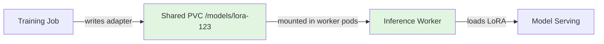
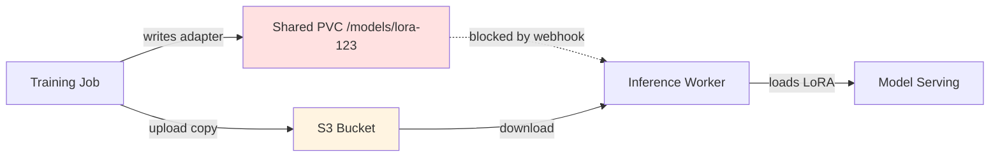
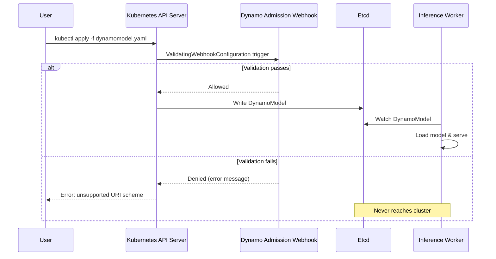

When you're running inference with LoRA adapters on a Kubernetes cluster with shared storage — a mounted PVC, Lustre, or NFS — you'd expect to be able to point your `DynamoModel` resource at `file:///mnt/models/lora-adapter` and have it work. The adapter files are already there. The worker pods can read them. But until last week, the NVIDIA Dynamo admission webhook would reject your spec with "unsupported URI scheme" before it ever reached a worker.

This mismatch between what the validation layer allowed and what the runtime actually supported meant teams had to work around it — uploading local adapters to S3, duplicating storage, or patching the webhook themselves. [PR #9675](https://github.com/ai-dynamo/dynamo/pull/9675) closes that gap by teaching the admission controller the same URI schemes the workers already understand.

<!--more-->

## The Problem: Validation Stricter Than Reality

NVIDIA Dynamo uses a **validating admission webhook** to enforce correctness on `DynamoModel` custom resources before they're written to etcd. When you `kubectl apply` a DynamoModel, the API server sends the spec to Dynamo's webhook, which checks things like: Are the tensor parallelism settings valid? Does the model source URI use a supported scheme?

Before this fix, the `validateSourceURI` function in the webhook looked like this:

```go
func validateSourceURI(uri string) error {
    u, err := url.Parse(uri)
    if err != nil {
        return fmt.Errorf("invalid URI: %w", err)
    }
    
    // Only s3:// and hf:// were allowed
    if u.Scheme != "s3" && u.Scheme != "hf" {
        return fmt.Errorf("unsupported URI scheme %q; only s3:// and hf:// are supported", u.Scheme)
    }
    
    return nil
}
```

This made sense when Dynamo only supported pulling models from S3 buckets or Hugging Face Hub. But downstream in the codebase, the **LocalLoRASource** loader — the component that actually reads LoRA adapter weights into memory — had been supporting `file://` URIs for months:

```go
// LocalLoRASource.Load can handle file:// URIs
func (l *LocalLoRASource) Load(ctx context.Context, sourceURI string) error {
    u, _ := url.Parse(sourceURI)
    
    switch u.Scheme {
    case "file":
        return l.loadFromFilesystem(u.Path)
    case "s3":
        return l.loadFromS3(u)
    case "hf":
        return l.loadFromHuggingFace(u)
    default:
        return fmt.Errorf("unsupported scheme: %s", u.Scheme)
    }
}
```

The worker could handle `file://`, but the admission webhook would never let a spec with `file://` reach the worker. Classic validation/runtime mismatch.

## Why This Mattered: The On-Prem Use Case

For teams running inference on-premises or in environments with high-speed shared storage (NFS, Lustre, CephFS, or Kubernetes PVCs backed by local NVMe), uploading local LoRA adapters to S3 just to download them again is wasteful:

1. **Storage duplication**: You're paying for the same adapter weights in two places.
2. **Network overhead**: Uploading multi-GB adapters to S3, then downloading them to workers, adds minutes of latency and S3 egress costs.
3. **Operational complexity**: Now you need S3 credentials in your inference cluster, even though the data never leaves your data center.

The typical workflow for fine-tuning teams looks like this:



The adapter is already on a filesystem accessible to the inference workers. But before this fix, the admission webhook forced you into this detour:



You're forced to upload the adapter to S3, then download it back to the same cluster, because the webhook wouldn't accept `file://`. The worker pods could read `/models/lora-123` directly — you just couldn't tell them to.

## The Fix: Accept What Workers Already Support

The solution is a three-line change to `validateSourceURI`:

```go
func validateSourceURI(uri string) error {
    u, err := url.Parse(uri)
    if err != nil {
        return fmt.Errorf("invalid URI: %w", err)
    }
    
    // Now accepts file://, s3://, and hf://
    if u.Scheme != "file" && u.Scheme != "s3" && u.Scheme != "hf" {
        return fmt.Errorf("unsupported URI scheme %q; supported schemes: file://, s3://, hf://", u.Scheme)
    }
    
    return nil
}
```

And updating the corresponding test from a negative case to a positive one:

```go
// Before: this test expected rejection
func TestValidateSourceURI_FileSchemeRejected(t *testing.T) {
    err := validateSourceURI("file:///mnt/models/lora")
    assert.Error(t, err)
    assert.Contains(t, err.Error(), "unsupported URI scheme")
}

// After: this test expects acceptance
func TestValidateSourceURI_FileSchemeAccepted(t *testing.T) {
    err := validateSourceURI("file:///mnt/models/lora")
    assert.NoError(t, err)
}
```

That's it. The admission webhook now accepts `file://` URIs. When a `DynamoModel` with `sourceURI: file:///mnt/models/lora-adapter` lands on a worker, `LocalLoRASource.Load` handles it the same way it always has — no runtime changes needed.

## Admission Control in Kubernetes: Why It Exists

The reason Dynamo uses a validating admission webhook in the first place is to **fail fast**. If you submit a `DynamoModel` with an invalid configuration — a nonsensical parallelism degree, a malformed URI, a missing required field — you want to know immediately, not after the spec has been written to etcd and picked up by a worker pod that then crashes trying to load it.



This is the admission control contract: validate at the API boundary, not at runtime. The failure mode when you get this wrong — when the webhook is *more* permissive than the workers — is silent: you submit a spec, it gets accepted, a worker picks it up, the worker crashes because it doesn't understand the config, and now you're debugging pod logs instead of getting an immediate error.

But the failure mode when the webhook is *less* permissive than the workers — which is what we had here — is frustration: users submit valid specs that would work fine at runtime, and the system rejects them for no reason. That's what [issue #9555](https://github.com/ai-dynamo/dynamo/issues/9555) reported, and that's what the fix addresses.

## What This Unlocks

With `file://` support in the admission webhook, teams can now:

1. **Use shared storage directly**: Mount a PVC at `/models` in worker pods, write LoRA adapters there from training jobs, and reference them as `file:///models/lora-adapter-name` in `DynamoModel` specs. No S3 detour.

2. **Reduce serving cold-start time**: For large LoRA adapters (multi-GB), reading from local NVMe or a high-speed Lustre mount is significantly faster than downloading from S3. This matters for autoscaling scenarios where new worker pods need to start serving quickly.

3. **Simplify credential management**: If your LoRA adapters never leave your cluster, you don't need to provision S3 access keys, manage bucket policies, or worry about egress costs.

The change is minimal and targeted: it aligns the admission webhook with the runtime's existing capabilities. No new features were added to the workers; we just stopped blocking a feature they already had.

## Why Small Fixes Matter

This is a six-line diff — three lines of logic, three lines of test updates. But it removes a real operational pain point for teams running Dynamo on-premises or with PVC-backed shared storage.

In distributed systems, mismatches between validation layers and runtime layers create friction that compounds over time. Users hit the mismatch, assume the system doesn't support their use case, and build workarounds. Those workarounds become institutional knowledge. New team members learn "you have to upload to S3 first" without questioning why. The actual system capability gets obscured.

Fixing the mismatch — making the validator accept what the runtime already supports — isn't just about correctness. It's about making the system behave the way users expect it to, so they spend less time working around it and more time using it.

---

**Pull Request**: [ai-dynamo/dynamo#9675](https://github.com/ai-dynamo/dynamo/pull/9675)  
**Issue**: [ai-dynamo/dynamo#9555](https://github.com/ai-dynamo/dynamo/issues/9555)
