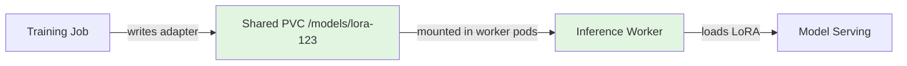
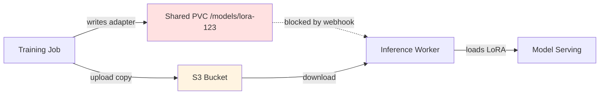
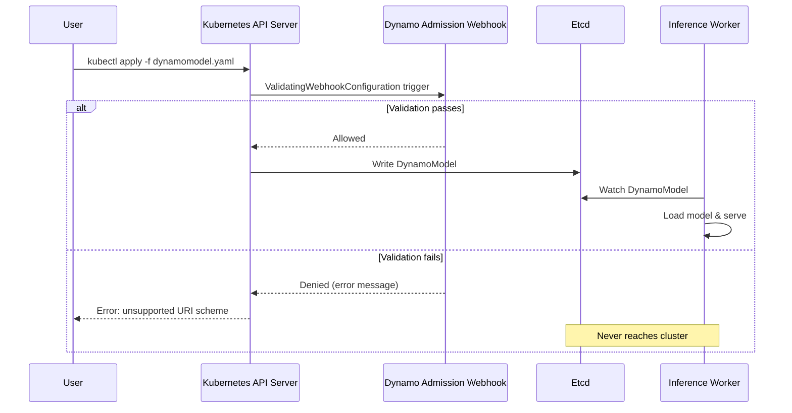

Here's a bug that looks trivial until you trace through why it exists: when you're running inference with LoRA adapters on a Kubernetes cluster with shared storage — a mounted PVC, Lustre, or NFS — you'd expect to be able to point your `DynamoModel` resource at `file:///mnt/models/lora-adapter` and have it work. The adapter files are already there. The worker pods can read them. But the NVIDIA Dynamo admission webhook would reject your spec with "unsupported URI scheme" before it ever reached a worker.

I hit this while investigating [issue #9555](https://github.com/ai-dynamo/dynamo/issues/9555), where a user running on-prem inference was blocked from using local storage despite having everything configured correctly. The mismatch was subtle: the validation layer was stricter than the runtime layer. The workers already supported `file://` URIs — had for months — but the admission webhook didn't know that. My [PR #9675](https://github.com/ai-dynamo/dynamo/pull/9675) fixes it, and the process taught me something about how validation/runtime gaps create invisible operational friction.

<!--more-->

## How I Found the Mismatch

The bug report was confusing at first. A user had LoRA adapters on a shared PVC mounted at `/models` in their worker pods. They submitted a `DynamoModel` with `sourceURI: file:///models/lora-adapter`, and the API server rejected it immediately with "unsupported URI scheme." But when I checked the worker code, `file://` URIs were clearly supported in the `LocalLoRASource` loader.

I started by looking at the admission webhook code — the `validateSourceURI` function that runs before specs reach etcd:

```go
func validateSourceURI(uri string) error {
    u, err := url.Parse(uri)
    if err != nil {
        return fmt.Errorf("invalid URI: %w", err)
    }
    
    // Only s3:// and hf:// were allowed
    if u.Scheme != "s3" && u.Scheme != "hf" {
        return fmt.Errorf("unsupported URI scheme %q; only s3:// and hf:// are supported", u.Scheme)
    }
    
    return nil
}
```

That validation made sense when Dynamo only supported pulling models from S3 buckets or Hugging Face Hub. But here's what I found when I traced through to the runtime code — the **LocalLoRASource** loader that actually reads LoRA adapter weights into memory:

```go
// LocalLoRASource.Load can handle file:// URIs
func (l *LocalLoRASource) Load(ctx context.Context, sourceURI string) error {
    u, _ := url.Parse(sourceURI)
    
    switch u.Scheme {
    case "file":
        return l.loadFromFilesystem(u.Path)
    case "s3":
        return l.loadFromS3(u)
    case "hf":
        return l.loadFromHuggingFace(u)
    default:
        return fmt.Errorf("unsupported scheme: %s", u.Scheme)
    }
}
```

The worker could handle `file://` — had been able to for months — but the admission webhook would never let a spec with `file://` reach the worker. Classic validation/runtime mismatch. Someone had added `file://` support to `LocalLoRASource` without updating the admission controller.

## Why This Matters: The On-Prem Use Case

This gap hit teams running inference on-premises or in environments with high-speed shared storage (NFS, Lustre, CephFS, or Kubernetes PVCs backed by local NVMe) particularly hard. Uploading local LoRA adapters to S3 just to download them again is wasteful:

1. **Storage duplication**: You're paying for the same adapter weights in two places.
2. **Network overhead**: Uploading multi-GB adapters to S3, then downloading them to workers, adds minutes of latency and S3 egress costs.
3. **Operational complexity**: Now you need S3 credentials in your inference cluster, even though the data never leaves your data center.

The typical workflow for fine-tuning teams looks like this:



The adapter is already on a filesystem accessible to the inference workers. But before this fix, the admission webhook forced you into this detour:



You're forced to upload the adapter to S3, then download it back to the same cluster, because the webhook wouldn't accept `file://`. The worker pods could read `/models/lora-123` directly — you just couldn't tell them to. That's the kind of friction that makes users assume the system doesn't support their use case, when it actually does.

## The Fix: Align Validation with Runtime

Once I understood the mismatch, the fix was straightforward — a three-line change to `validateSourceURI`:

```go
func validateSourceURI(uri string) error {
    u, err := url.Parse(uri)
    if err != nil {
        return fmt.Errorf("invalid URI: %w", err)
    }
    
    // Now accepts file://, s3://, and hf://
    if u.Scheme != "file" && u.Scheme != "s3" && u.Scheme != "hf" {
        return fmt.Errorf("unsupported URI scheme %q; supported schemes: file://, s3://, hf://", u.Scheme)
    }
    
    return nil
}
```

And updating the corresponding test from a negative case to a positive one:

```go
// Before: this test expected rejection
func TestValidateSourceURI_FileSchemeRejected(t *testing.T) {
    err := validateSourceURI("file:///mnt/models/lora")
    assert.Error(t, err)
    assert.Contains(t, err.Error(), "unsupported URI scheme")
}

// After: this test expects acceptance
func TestValidateSourceURI_FileSchemeAccepted(t *testing.T) {
    err := validateSourceURI("file:///mnt/models/lora")
    assert.NoError(t, err)
}
```

That's it. The admission webhook now accepts `file://` URIs. When a `DynamoModel` with `sourceURI: file:///mnt/models/lora-adapter` lands on a worker, `LocalLoRASource.Load` handles it the same way it always has — no runtime changes needed.

I also updated the test suite to reflect the new behavior — converting the old "file:// should be rejected" test into a positive "file:// should be accepted" case. Small change, but it documents the intended behavior.

## What I Learned: Admission Control as a Double-Edged Sword

This fix helped me understand why admission webhooks exist in the first place — and why they're tricky to get right.

Dynamo uses a validating admission webhook to **fail fast**. If you submit a `DynamoModel` with an invalid configuration — a nonsensical parallelism degree, a malformed URI, a missing required field — you want to know immediately, not after the spec has been written to etcd and picked up by a worker pod that then crashes trying to load it.



This is the admission control contract: validate at the API boundary, not at runtime. But here's what I learned debugging this issue: **there are two ways to get admission control wrong**, and they have very different failure modes.

**Webhook too permissive**: If the webhook accepts configs that workers can't handle, you get silent failures. Specs get written to etcd, workers pick them up, workers crash, and now you're debugging pod logs trying to figure out why.

**Webhook too strict**: If the webhook rejects configs that workers *could* handle — which is what we had here — you get user frustration. Users submit valid specs that would work fine at runtime, and the system rejects them for no apparent reason. That's what [issue #9555](https://github.com/ai-dynamo/dynamo/issues/9555) reported.

The second failure mode is more subtle because the system isn't "broken" — it's just unnecessarily restrictive. But the operational impact is real: users assume the feature doesn't exist and build workarounds instead of using the system as designed.

## What This Unlocks

With `file://` support in the admission webhook, teams can now:

1. **Use shared storage directly**: Mount a PVC at `/models` in worker pods, write LoRA adapters there from training jobs, and reference them as `file:///models/lora-adapter-name` in `DynamoModel` specs. No S3 detour.

2. **Reduce serving cold-start time**: For large LoRA adapters (multi-GB), reading from local NVMe or a high-speed Lustre mount is significantly faster than downloading from S3. This matters for autoscaling scenarios where new worker pods need to start serving quickly.

3. **Simplify credential management**: If your LoRA adapters never leave your cluster, you don't need to provision S3 access keys, manage bucket policies, or worry about egress costs.

The change is minimal and targeted: it aligns the admission webhook with the runtime's existing capabilities. No new features were added to the workers; I just stopped the webhook from blocking a feature they already had.

## Why This Kind of Fix Matters

This is a six-line diff — three lines of logic, three lines of test updates. I've worked on much larger contributions to Dynamo. But this one taught me something about how validation/runtime gaps compound over time.

Here's what happens when you leave these mismatches unfixed: Users hit the restrictive validator, assume the system doesn't support their use case, and build workarounds. Those workarounds become institutional knowledge. New team members learn "you have to upload to S3 first" without questioning why. The actual system capability — that workers can read from `file://` URIs — gets obscured by layers of unnecessary process.

Fixing the mismatch isn't just about technical correctness. It's about making the system behave the way users reasonably expect it to. Teams running on-prem with shared storage shouldn't need to route through S3. The workers already support local paths. The admission webhook should too.

That's what I like about this kind of infrastructure work: the fix is small, but it removes real operational friction. And you only find these gaps by tracing through the full stack — from the user's rejected `kubectl apply` command, through the admission webhook, down to the worker runtime code that's quietly been supporting the feature all along.

---

**Pull Request**: [ai-dynamo/dynamo#9675](https://github.com/ai-dynamo/dynamo/pull/9675)  
**Issue**: [ai-dynamo/dynamo#9555](https://github.com/ai-dynamo/dynamo/issues/9555)
