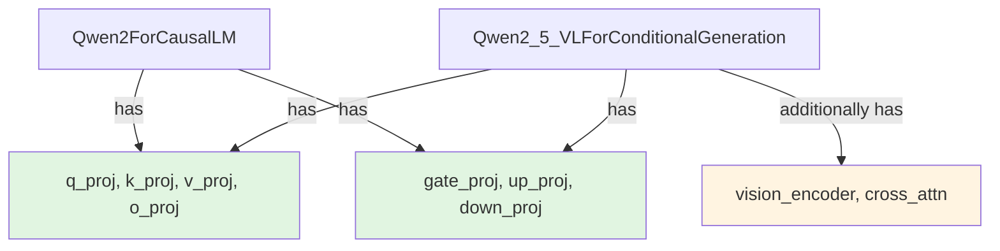
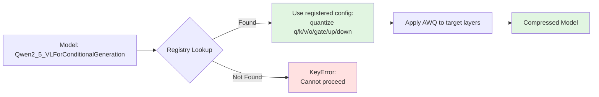

When you try to quantize a new multimodal model with AWQ or SmoothQuant and the compression library crashes with `KeyError: 'Qwen2_5_VLForConditionalGeneration'`, the root cause isn't a missing algorithm implementation. The algorithm exists. The model architecture is supported. What's missing is a **registry entry** — a mapping that tells the compressor which layers in this specific model class should be quantized and how.

Last month I contributed [PR #2727](https://github.com/vllm-project/llm-compressor/pull/2727) to `llm-compressor`, adding five model classes to the AWQ and SmoothQuant registries. No new quantization logic. No architectural changes. Just teaching the library that `Qwen2_5_VLForConditionalGeneration` uses the same projection structure as `Qwen2ForCausalLM`, so it should be treated the same way.

This is how quantization registries quietly gate which models work — and why missing entries break more than you'd expect.

<!--more-->

## How llm-compressor Decides What to Quantize

`llm-compressor` is the compression engine behind vLLM's quantization support. When you run AWQ or SmoothQuant on a model, the library doesn't inspect the PyTorch module graph to figure out which layers are "quantizable." Instead, it looks up the model's class name in a **registry** — a dictionary mapping model architectures to a list of layer names (or projection patterns) that should be compressed.

Here's the AWQ registry before this fix:

```python
# llm_compressor/transformers/compression/quantization_awq.py
AWQ_MODEL_REGISTRY = {
    "LlamaForCausalLM": QuantizationConfig(
        targets=["q_proj", "k_proj", "v_proj", "o_proj", "gate_proj", "up_proj", "down_proj"],
    ),
    "Qwen2ForCausalLM": QuantizationConfig(
        targets=["q_proj", "k_proj", "v_proj", "o_proj", "gate_proj", "up_proj", "down_proj"],
    ),
    "MistralForCausalLM": QuantizationConfig(
        targets=["q_proj", "k_proj", "v_proj", "o_proj", "gate_proj", "up_proj", "down_proj"],
    ),
    # ... dozens more
}
```

When you load a model and call `apply_awq()`, the compressor runs:

```python
model_class = type(model).__name__  # e.g., "Qwen2_5_VLForConditionalGeneration"
config = AWQ_MODEL_REGISTRY.get(model_class)

if config is None:
    raise KeyError(f"Model class {model_class} not found in AWQ registry")

# Proceed to quantize the layers in config.targets
```

If your model class isn't in the registry, compression fails — even if the model's architecture is nearly identical to one that *is* registered. The registry is an explicit allowlist.

## The Problem: New Model Classes, Same Architecture

The issue reported in [#1442](https://github.com/vllm-project/llm-compressor/issues/1442) was straightforward: `Qwen2_5_VLForConditionalGeneration` — the new Qwen 2.5 vision-language model — wasn't in the AWQ registry. When users tried to quantize it, they hit:

```
KeyError: 'Qwen2_5_VLForConditionalGeneration' not found in AWQ_MODEL_REGISTRY
```

But `Qwen2ForCausalLM` *was* registered. And the two models share the same projection layer structure — same attention and MLP projection names, same number of quantizable targets. The difference is that `Qwen2_5_VLForConditionalGeneration` adds vision encoders and cross-attention for multimodal inputs, but those additions don't change which language-model layers should be quantized.

From the registry's perspective, these are the same:



The green blocks — the language model projections — are identical. The yellow block is new, but it's not part of AWQ's target set anyway. Yet without an explicit registry entry for the new class, compression fails.

## The Fix: Explicit Mappings for Multimodal and Newer Models

The solution is to add the missing model classes to the registries with the correct projection mappings. For AWQ, that meant adding:

```python
AWQ_MODEL_REGISTRY = {
    # ... existing entries ...
    
    # New multimodal and newer models
    "Qwen2_5_VLForConditionalGeneration": QuantizationConfig(
        targets=["q_proj", "k_proj", "v_proj", "o_proj", "gate_proj", "up_proj", "down_proj"],
    ),
    "Qwen2_5OmniThinkerForConditionalGeneration": QuantizationConfig(
        targets=["q_proj", "k_proj", "v_proj", "o_proj", "gate_proj", "up_proj", "down_proj"],
    ),
    "SeedOssForCausalLM": QuantizationConfig(
        targets=["q_proj", "k_proj", "v_proj", "o_proj", "gate_proj", "up_proj", "down_proj"],
    ),
    "Ernie4_5_MoeForCausalLM": QuantizationConfig(
        targets=["q_proj", "k_proj", "v_proj", "o_proj", "gate_proj", "up_proj", "down_proj"],
    ),
}
```

For SmoothQuant, the same four models (plus `Qwen2_5_VLForConditionalGeneration`) were added. Some of these were already in the AWQ registry but missing from SmoothQuant — another form of the same registry-gap problem.

### Special Case: MoE Models

One model required a design choice: **Ernie4_5_MoeForCausalLM**, Baidu's mixture-of-experts architecture. MoE models have two quantization strategies in `llm-compressor`:

1. **Standard default mapping**: Treat expert projections like any other MLP layer — quantize `gate_proj`, `up_proj`, `down_proj` inside each expert.
2. **QWEN_MOE-style MLP skipping**: Some MoE models (like older Qwen MoE variants) skip quantizing expert MLP layers because the router's load-balancing breaks with naïve per-expert quantization.

The question: which strategy should `Ernie4_5_MoeForCausalLM` use?

I followed the precedent set by `Glm4MoeForCausalLM`, another MoE model in the registry that uses the **default mapping** (quantize everything). This is the safer choice for newer MoE architectures, which typically have routers that are stable under quantization. If Ernie 4.5's router turns out to be sensitive, users can override the config — but the default should be "quantize like a standard transformer."

## Why Registries Exist: The Tradeoff Between Flexibility and Safety

You might ask: why have a registry at all? Why not just inspect the model's module graph at runtime, find all `nn.Linear` layers, and quantize those?

The answer is that **quantization isn't uniform**. Not every linear layer in a transformer should be quantized the same way:

- **Attention projections** (Q, K, V, O) are sensitive to quantization and benefit from per-channel scaling.
- **MLP projections** (gate, up, down) are less sensitive and can tolerate coarser quantization.
- **Embedding layers** and **layer norms** are typically *not* quantized, because their parameter counts are small and quantizing them degrades quality with minimal memory savings.
- **LoRA adapters** and **cross-attention** in multimodal models often need special handling.

A naive "quantize all `nn.Linear` layers" heuristic would break models. The registry is an explicit contract: "For this model class, these specific layers should be quantized with this strategy."



The tradeoff is maintenance burden: every new model architecture needs an explicit registry entry. But the benefit is correctness: quantization only happens where it's known to be safe and effective.

## What This Unlocks

With these five model classes now registered, users can:

1. **Quantize Qwen 2.5 multimodal models** with AWQ or SmoothQuant without patching the library.
2. **Use SmoothQuant on newer models** that were previously AWQ-only due to missing SmoothQuant entries.
3. **Compress Ernie 4.5 MoE** with confidence that the default quantization strategy follows established MoE precedents.

The change is pure registry data — no algorithmic logic, no new quantization kernels. But it's the difference between "this model works" and "this model crashes at compression time."

## The Bigger Picture: Model Support as a First-Class Maintenance Task

In fast-moving ML ecosystems, **model registry maintenance is infrastructure work**. When Hugging Face releases a new vision-language model or an open-source MoE variant, the first question users ask is: "Does this work with vLLM? Does it work with quantization?"

If the answer is "yes, but you have to fork the compressor and add a registry entry yourself," adoption suffers. If the answer is "yes, out of the box," adoption accelerates.

This PR is part of that maintenance surface: keeping the registry up to date with models that are landing in production. Not glamorous, not algorithmically novel, but critical for users who need these models to *just work*.

For quantization libraries like `llm-compressor`, the registry is a promise: "We've tested these models. We know which layers to compress. It's safe to proceed." Missing entries break that promise — not because the model is incompatible, but because no one's told the library it's compatible yet.

That's what registry contributions fix: they close the gap between "architecturally supported" and "explicitly enabled."

---

**Pull Request**: [vllm-project/llm-compressor#2727](https://github.com/vllm-project/llm-compressor/pull/2727)  
**Issue**: [vllm-project/llm-compressor#1442](https://github.com/vllm-project/llm-compressor/issues/1442)
